# User_Management_Dashboard_App

### Description

The User Management App is a web application designed to manage and display information about various users. It offers features such as adding new users, editing user details, deleting users, and viewing a list of all users along with their respective information. The app is built using a combination of React and Node.js, with a MongoDB database to store users data.


## Table of Contents

-   Features
-   Tech Stack
-   Getting Started
    - Prerequisites
    - Installation
-   API Documentation
-   Usage
-   Project Structure
-   Deployement
-   Contributing
-   License


## Features

-   **Add New User** : Admin can add new users to the database, including users firstName, lastName, email, contact, departmentName and other relevant information.

-   **Edit User Details** : Existing user details can be updated, allowing users to modify information such as the user's name, contact, or departmentName etc.

-   **Delete User** : User can be removed from the database if they are no longer relevant.

-   **View All Users** :  Admin can effortlessly explore a rich database of users, refining searches by first or last name. Integrated pagination ensures a seamless browsing experience.

-   **Responsive Design** : Ensuring seamless responsiveness across all user displays for an optimal and inclusive user experience.


## Tech Stack

-   **Frontend** :
    - React
    - Material UI
    - Redux for state management
    - React hooks (useState, useEffect, useSearchParams, useLocation etc.)

-   **Backend** :
    - Node.js
    - Express.js for building the API
    - mongoose as the ODM (Object Data Modeling)
    - MongoDB-Atlas as the backend database


## Getting Started

-   Follow these instructions to set up and run the project on your local machine.

-   **Prerequisites**

    - Node.js and npm installed
    - MongoDB database server
    - Git 

-   **Installation**

    - Clone the repository : ***git clone https://github.com/Niteshthori24198/tacnique_User_Management_App***
    - Navigate to the project directory : **cd backend/frontend**
    - Install frontend dependencies : ***npm install***
    - Install backend dependencies : ***npm install***
    - Configure the database connection in the server configuration files.
    - Run the development server for the frontend and backend separately :
        - FrontEnd : ***npm start***
        - BackEnd : ***npm run server***


# API Documentation

## CRUD Operations

| Endpoint           | Method | Description                 | Request Payload           | Response                   |
|--------------------|--------|-----------------------------|---------------------------|----------------------------|
| `/api/users/view`   | GET    | Get users data               | UserId , page, limit, search as query                      | Single/All user object         |
| `/api/users/add`       | POST   | Create a new user           | User object               | Created user object        |
| `/api/users/edit/:userId`   | PUT    | Update user by ID           | Updated user object       | Updated user object        |
| `/api/users/delete/:userId`   | DELETE | Delete user by ID           | None                      | Deleted user object        |


## Request and Response Examples

#### GET :  /api/users/view?userId=""&search=""&page=1&limit=5

## Request Object 
```
query params : {
    page:1,
    limit:5,
    search:'name'
}
```

## Response Object
```
{
  "message": "User found",
  "status": 200,
  "data": [
    {
      "_id": "65b35414e5c66b21463d7269",
      "userId": "8740c287-20d1-4cc1-812a-845a6d0a891b",
      "email": "abhirup@gmail.com",
      "firstName": "Abhirup",
      "lastName": "Bakshi",
      "contact": 8875694523,
      "departmentName": "Backend Development",
      "createdAt": "2024-01-26T06:41:24.544Z",
      "updatedAt": "2024-01-26T09:51:24.766Z"
    }
  ]
}
```

#### POST : api/users/add

## Request Object 
    {
    "email":"john.deo@gmail.com",
    "firstName":"John",
    "lastName":"deo",
    "contact":7894561230,
    "departmentName":"Computer Science"
    }

## Response Object
    {
    "message": "New User added successfully",
    "status": 200,
    "data": {
        "userId": "8d03b2ec-bee4-4692-a0ca-77c87daad8ee",
        "email": "john.deo@gmail.com",
        "firstName": "John",
        "lastName": "deo",
        "contact": 7894561230,
        "departmentName": "Computer Science",
        "_id": "65b39bb5d55d1a06257ca8a7",
        "createdAt": "2024-01-26T11:47:01.211Z",
        "updatedAt": "2024-01-26T11:47:01.211Z"
    }
    }


## PUT/PATCH : api/users/edit/:userId

## Request Object 
    {
    "firstName":"Jack",
    "contact":8745961230,
    "departmentName": "Information Technology"
    }


## Response Object
    {
    "message": "User Updated successfully",
    "status": 200,
    "data": {
        "userId": "8d03b2ec-bee4-4692-a0ca-77c87daad8ee",
        "email": "john.deo@gmail.com",
        "firstName": "Jack",
        "lastName": "deo",
        "contact": 8745961230,
        "departmentName": "Information Technology",
        "_id": "65b39bb5d55d1a06257ca8a7",
        "createdAt": "2024-01-26T11:47:01.211Z",
        "updatedAt": "2024-01-26T11:47:01.211Z"
    }
    }


## DELETE : api/users/delete/:userId

## Response Object
    {
    "message": "User Deleted successfully",
    "status": 200,
    "data": {
        "userId": "8d03b2ec-bee4-4692-a0ca-77c87daad8ee",
        "email": "john.deo@gmail.com",
        "firstName": "Jack",
        "lastName": "deo",
        "contact": 8745961230,
        "departmentName": "Information Technology",
        "_id": "65b39bb5d55d1a06257ca8a7",
        "createdAt": "2024-01-26T11:47:01.211Z",
        "updatedAt": "2024-01-26T11:47:01.211Z"
    }
    }


## Usage

-   Visit the app in your web browser.
-   Use the navigation and user interface to add, edit, delete, and view users listings.


-   Snapshots of the App is attached below.


### Home Page


### Add New User Page

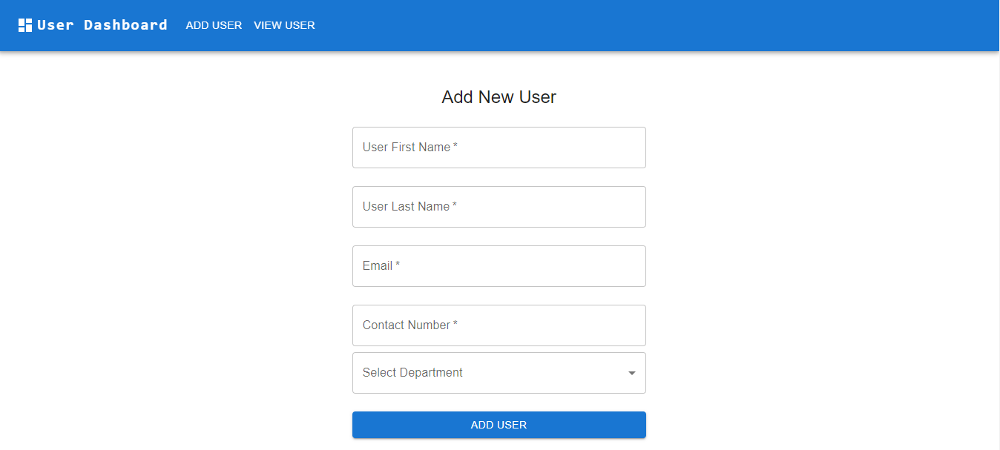

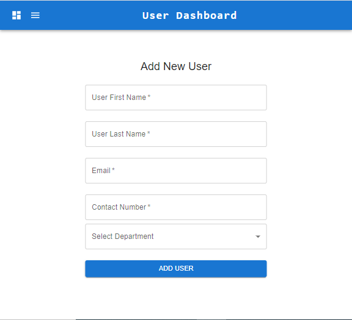

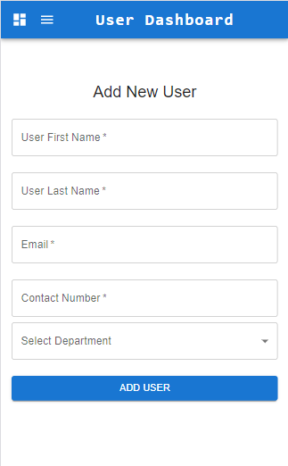


### User Page

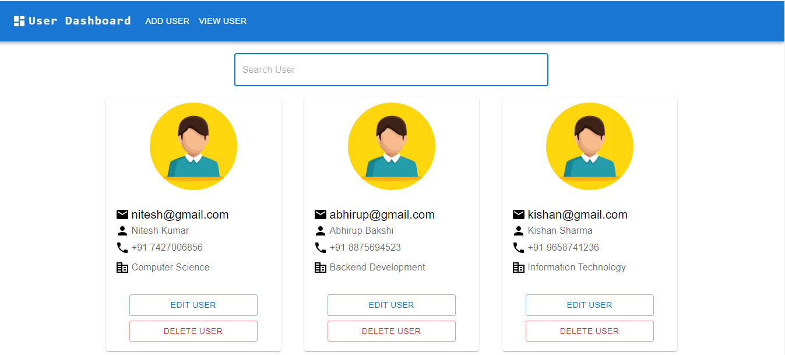

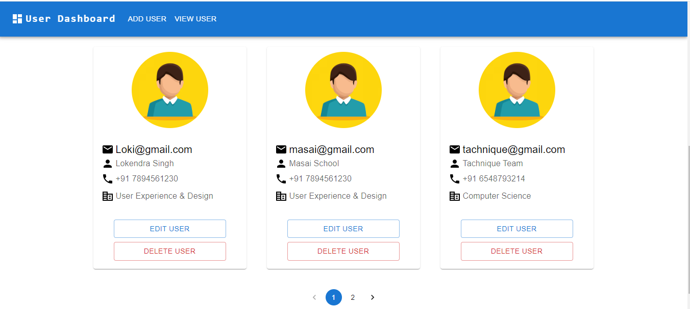

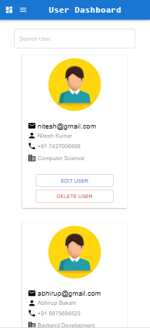

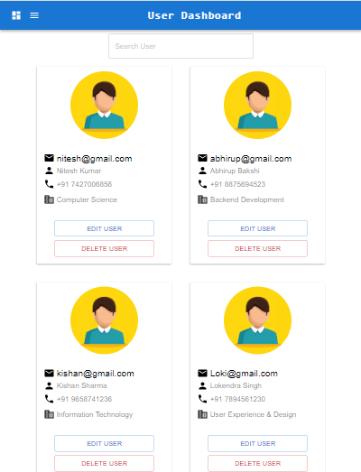

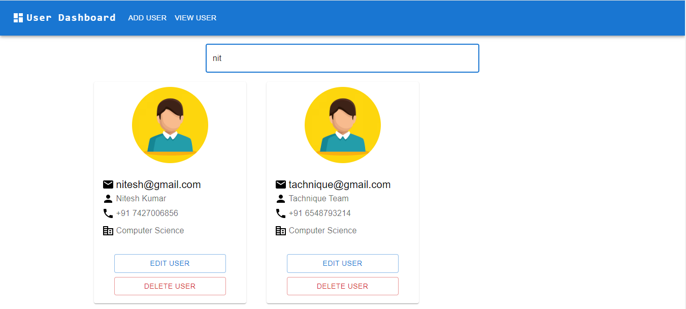

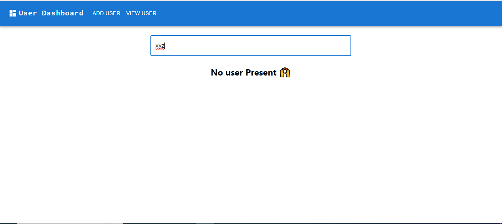


### Edit User Page

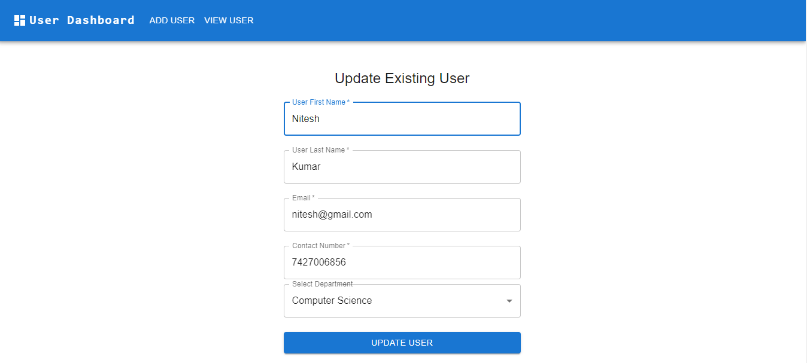

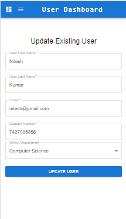


## Project Structure

-   **Backend** : Contains the entire backend Node.js and Express application along with database.
-   **frontend** : Contains Material UI template for the frontend along with Redux.


## Deployement

-   **Backend API Link** :- 
***https://usermanagement-dashboard-be-niteshthori24198.vercel.app/***

-   **Frontend Link** :-
***https://user-management-app-niteshthori24198.vercel.app/***


## Contributing

-   Contributions are welcome! Feel free to enhance our project by submitting your ideas, bug fixes, or new features through pull requests.


## License

-   This project is licensed under the MIT License - see the LICENSE file for details.


